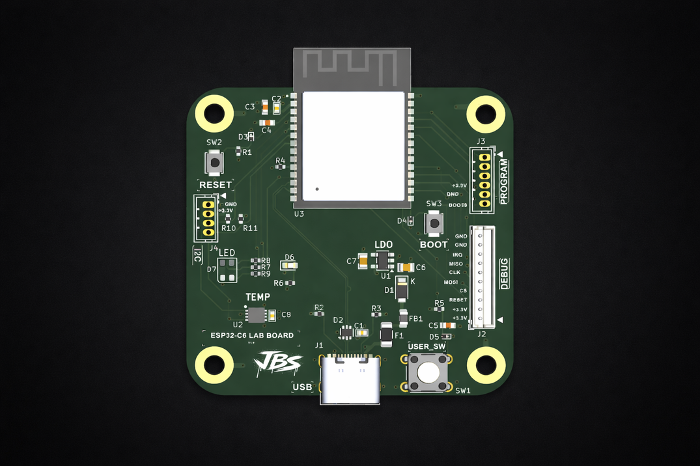

#ESP32-C6_LAB_BOARD

EMBEDDED HARDWARE / MICROCONTROLLER PCB DESIGN PROJECT

WI-FI/BLUEBOOTH
CUSTOM EMBEDDED MICROCONTROLLER PCB DESIGNED FOR BRING-UP, DEBUG, AND INTERFACE VALIDATION

WAITING ON BOARDS TO BE DELIVERED

DESIGNED & ENGINEERED BY BRANDON SHELLY